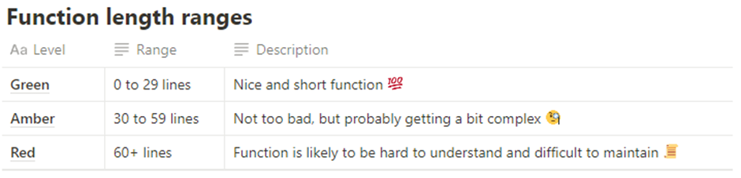

# Experiment 1 Notes
## Can a Large Language Model Produce High Quality Code?
#### Description of Experiment:
For this test, I will be using the LLMs to produce a console app with each model. These can then be assessed using the given metrics. 
 
This experiment will undergo three iterations. The intention is, to assess the code on the initial prompt, the second one will try to extend the application. The third iteration will extend the application again. This will test how capable the LLM is at dealing with a much larger codebase.

#### Codebase:  
3 mini Ruby based console apps. It will have various classes/modules. Therefore, you'll be able to assess the functions for the quality. 
****************
### Function Length Reference
* For clarity, I am measuring the number of lines inside of a function. Do not include, the end, and declaration of the function
* Some have whitespace - have included as I don't want to edit this 


### Pre-Defined Prompts

## Iteration 1
Can you write me a console app for a library tracking system in Ruby 3.2?

### ChatGPT
##### Observation

### Codeium
#### Observation

### CoPilot
#### Observation

## Iteration 2
Can you extend this?
I would like to use several different classes, various functions, inheritance, and be able to save the users, and their books in something like a txt file.
I would also like a case statement to simulate a basic user interface. Can you do this please?

### ChatGPT
##### Observation

### Codeium
#### Observation

### CoPilot
#### Observation

## Iteration 3
Can you further this, I have gathered some requirements, here they are. Can you complete the code based on these?

### ChatGPT
##### Observation

### Codeium
#### Observation

### CoPilot
#### Observation

# ChatGPT
Process:
* Began prompting for ideas which I could choose from for the model to build
* Began by prompting the model to build me a procedural app.
* 
* 

## Results Table: ChatGPT

### Iteration 1 - Code from Initial Prompt

```
Class Library
-------------

| Metric                       |    Function     |   Score  |
|------------------------------|-----------------|----------|
| Argument Count               |  initialize     |    2     |
|                              |  add_books      |    3     |
|                              |  view_books     |    0     |
|                              |  search_books   |    1     |
|                              |  load_books     |    0     |
|                              |  save_books     |    0     |
|                              |  main           |    0     | 
|------------------------------|-----------------|----------|
| Nesting Depth                |  initialize     |    0     |
|                              |  add_books      |    0     |
|                              |  view_books     |    2     |
|                              |  search_books   |    2     |
|                              |  main           |    1     | 
|------------------------------|-----------------|----------|
| Function Length              |  initialize     |    2     |
|                              |  add_books      |    4     |
|                              |  view_books     |    9     |
|                              |  search_books   |    11    |
|                              |  main           |    41    | 
|------------------------------|-----------------|----------|
| Depth of Inheritance         |  initialize     |    0     |
|                              |  add_books      |    0     |
|                              |  view_books     |    0     |
|                              |  search_books   |    0     |
|                              |  main           |    0     | 
|                              |                 |          |
```

### Iteration 2 - Extend the Codebase
```
Class Book
----------

| Metric                       |    Function     |   Score  |
|------------------------------|-----------------|----------|
| Argument Count               |                 |          |
|                              |                 |          |
|------------------------------|-----------------|----------|
| Nesting Depth                |                 |          |            
                                                 |          |
|------------------------------|-----------------|----------|
| Function Length              |                 |          |
|                              |                 |          |
|------------------------------|-----------------|----------|
| Depth of Inheritance         |                 |          |
|                              |                 |          |
```

```
Class Library
-------------

| Metric                       |    Function     |   Score  |
|------------------------------|-----------------|----------|
| Argument Count               |                 |          |
|                              |                 |          |
|                              |                 |          |
|                              |                 |          |
|                              |                 |          |
|                              |                 |          |
|                              |                 |          | 
|------------------------------|-----------------|----------|
| Nesting Depth                |                 |          |
|                              |                 |          | 
|                              |                 |          |
|                              |                 |          |
|                              |                 |          |
|                              |                 |          |
|                              |                 |          | 
|------------------------------|-----------------|----------|
| Function Length              |                 |          |
|                              |                 |          |
|                              |                 |          |
|                              |                 |          |
|                              |                 |          |
|                              |                 |          |
|                              |                 |          | 
|------------------------------|-----------------|----------|
| Depth of Inheritance         |                 |          |
|                              |                 |          |
|                              |                 |          |
|                              |                 |          |
|                              |                 |          |
|                              |                 |          |
|                              |                 |          | 
|                              |                 |          |
```
### Iteration 3 - Extend the Codebase
```
Class Book
----------

| Metric                       |    Function     |   Score  |
|------------------------------|-----------------|----------|
| Argument Count               |                 |          |
|                              |                 |          |
|------------------------------|-----------------|----------|
| Nesting Depth                |                 |          |            
                                                 |          |
|------------------------------|-----------------|----------|
| Function Length              |                 |          |
|                              |                 |          |
|------------------------------|-----------------|----------|
| Depth of Inheritance         |                 |          |
|                              |                 |          |
```

```
Class Library
-------------

| Metric                       |    Function     |   Score  |
|------------------------------|-----------------|----------|
| Argument Count               |                 |          |
|                              |                 |          |
|                              |                 |          |
|                              |                 |          |
|                              |                 |          |
|                              |                 |          |
|                              |                 |          | 
|------------------------------|-----------------|----------|
| Nesting Depth                |                 |          |
|                              |                 |          | 
|                              |                 |          |
|                              |                 |          |
|                              |                 |          |
|                              |                 |          |
|                              |                 |          | 
|------------------------------|-----------------|----------|
| Function Length              |                 |          |
|                              |                 |          |
|                              |                 |          |
|                              |                 |          |
|                              |                 |          |
|                              |                 |          |
|                              |                 |          | 
|------------------------------|-----------------|----------|
| Depth of Inheritance         |                 |          |
|                              |                 |          |
|                              |                 |          |
|                              |                 |          |
|                              |                 |          |
|                              |                 |          |
|                              |                 |          | 
|                              |                 |          |
```

***
# Codeium

Process:
*
*
*
*

## Results Table: Codeium


### Iteration 1 - Initial Prompt Code

```
Class Book
----------

| Metric                       |    Function     |   Score  |
|-----------------------------------------------------------|
| Argument Count               |  initialize     |          |
|                              |    to_s         |          |
|------------------------------|-----------------|----------|
| Nesting Depth                |  initialize     |          |
                                   to_s          |          |
|------------------------------|-----------------|----------|
| Function Length              |  initialize     |          |
                                   to_s          |          |
|------------------------------|-----------------|----------|
| Depth of Inheritance         |  initialize     |          |
|                                   to_s         |          |

```

```
Class Library
-------------

| Metric                       |    Function     |   Score  |
|-----------------------------------------------------------|
| Argument Count               |  initialize     |          |
|                              |  add_books      |          |
|                              |  view_books     |          |
|                              |  search_books   |          |
|                              |  load_books     |          |
|                              |  save_books     |          |
|                              |  main           |          | 
|                              |                 |          |
|------------------------------|-----------------|----------|
| Nesting Depth                |  initialize     |          |
|                              |  add_books      |          |
|                              |  view_books     |          |
|                              |  search_books   |          |
|                              |  load_books     |          |
|                              |  save_books     |          |
|                              |  main           |          | 
|                              |                 |          |
|------------------------------|-----------------|----------|
| Function Length              |  initialize     |          |
|                              |  add_books      |          |
|                              |  view_books     |          |
|                              |  search_books   |          |
|                              |  load_books     |          |
|                              |  save_books     |          |
|                              |  main           |          | 
|                              |                 |          |
|------------------------------|-----------------|----------|
| Depth of Inheritance         |  initialize     |          |
|                              |  add_books      |          |
|                              |  view_books     |          |
|                              |  search_books   |          |
|                              |  load_books     |          |
|                              |  save_books     |          |
|                              |  main           |          | 
|                              |                 |          |
```

## Iteration 2 - Extend the Codebase
```
Class Book
----------

| Metric                       |    Function     |   Score  |
|------------------------------|-----------------|----------|
| Argument Count               |                 |          |
|                              |                 |          |
|------------------------------|-----------------|----------|
| Nesting Depth                |                 |          |            
                                                 |          |
|------------------------------|-----------------|----------|
| Function Length              |                 |          |
|                              |                 |          |
|------------------------------|-----------------|----------|
| Depth of Inheritance         |                 |          |
|                              |                 |          |
```

```
Class Library
-------------

| Metric                       |    Function     |   Score  |
|------------------------------|-----------------|----------|
| Argument Count               |                 |          |
|                              |                 |          |
|                              |                 |          |
|                              |                 |          |
|                              |                 |          |
|                              |                 |          |
|                              |                 |          | 
|------------------------------|-----------------|----------|
| Nesting Depth                |                 |          |
|                              |                 |          | 
|                              |                 |          |
|                              |                 |          |
|                              |                 |          |
|                              |                 |          |
|                              |                 |          | 
|------------------------------|-----------------|----------|
| Function Length              |                 |          |
|                              |                 |          |
|                              |                 |          |
|                              |                 |          |
|                              |                 |          |
|                              |                 |          |
|                              |                 |          | 
|------------------------------|-----------------|----------|
| Depth of Inheritance         |                 |          |
|                              |                 |          |
|                              |                 |          |
|                              |                 |          |
|                              |                 |          |
|                              |                 |          |
|                              |                 |          | 
|                              |                 |          |
```
## Iteration 3 - Extend the Codebase
```
Class Book
----------

| Metric                       |    Function     |   Score  |
|------------------------------|-----------------|----------|
| Argument Count               |                 |          |
|                              |                 |          |
|------------------------------|-----------------|----------|
| Nesting Depth                |                 |          |            
                                                 |          |
|------------------------------|-----------------|----------|
| Function Length              |                 |          |
|                              |                 |          |
|------------------------------|-----------------|----------|
| Depth of Inheritance         |                 |          |
|                              |                 |          |
```

```
Class Library
-------------

| Metric                       |    Function     |   Score  |
|------------------------------|-----------------|----------|
| Argument Count               |                 |          |
|                              |                 |          |
|                              |                 |          |
|                              |                 |          |
|                              |                 |          |
|                              |                 |          |
|                              |                 |          | 
|------------------------------|-----------------|----------|
| Nesting Depth                |                 |          |
|                              |                 |          | 
|                              |                 |          |
|                              |                 |          |
|                              |                 |          |
|                              |                 |          |
|                              |                 |          | 
|------------------------------|-----------------|----------|
| Function Length              |                 |          |
|                              |                 |          |
|                              |                 |          |
|                              |                 |          |
|                              |                 |          |
|                              |                 |          |
|                              |                 |          | 
|------------------------------|-----------------|----------|
| Depth of Inheritance         |                 |          |
|                              |                 |          |
|                              |                 |          |
|                              |                 |          |
|                              |                 |          |
|                              |                 |          |
|                              |                 |          | 
|                              |                 |          |
```

***

# CoPilot
***
Process:
*
*
*
*

## Results Table: CoPilot

### Iteration 1 - Intial Codebase Prompt
```


Class Book
----------

| Metric                       |    Function     |   Score  |
|-----------------------------------------------------------|
| Argument Count               |  initialize     |          |
|                              |    to_s         |          |
|------------------------------|-----------------|----------|
| Nesting Depth                |  initialize     |          |
                                   to_s          |          |
|------------------------------|-----------------|----------|
| Function Length              |  initialize     |          |
                                   to_s          |          |
|------------------------------|-----------------|----------|
| Depth of Inheritance         |  initialize     |          |
|                                   to_s         |          |

```

```
Class Library
-------------

| Metric                       |    Function     |   Score  |
|-----------------------------------------------------------|
| Argument Count               |  initialize     |          |
|                              |  add_books      |          |
|                              |  view_books     |          |
|                              |  search_books   |          |
|                              |  load_books     |          |
|                              |  save_books     |          |
|                              |  main           |          | 
|                              |                 |          |
|------------------------------|-----------------|----------|
| Nesting Depth                |  initialize     |          |
|                              |  add_books      |          |
|                              |  view_books     |          |
|                              |  search_books   |          |
|                              |  load_books     |          |
|                              |  save_books     |          |
|                              |  main           |          | 
|                              |                 |          |
|------------------------------|-----------------|----------|
| Function Length              |  initialize     |          |
|                              |  add_books      |          |
|                              |  view_books     |          |
|                              |  search_books   |          |
|                              |  load_books     |          |
|                              |  save_books     |          |
|                              |  main           |          | 
|                              |                 |          |
|------------------------------|-----------------|----------|
| Depth of Inheritance         |  initialize     |          |
|                              |  add_books      |          |
|                              |  view_books     |          |
|                              |  search_books   |          |
|                              |  load_books     |          |
|                              |  save_books     |          |
|                              |  main           |          | 
|                              |                 |          |
```
***

### Iteration 2 - Extend the Codebase
```
Class Book
----------

| Metric                       |    Function     |   Score  |
|------------------------------|-----------------|----------|
| Argument Count               |                 |          |
|                              |                 |          |
|------------------------------|-----------------|----------|
| Nesting Depth                |                 |          |            
                                                 |          |
|------------------------------|-----------------|----------|
| Function Length              |                 |          |
|                              |                 |          |
|------------------------------|-----------------|----------|
| Depth of Inheritance         |                 |          |
|                              |                 |          |
```

```
Class Library
-------------

| Metric                       |    Function     |   Score  |
|------------------------------|-----------------|----------|
| Argument Count               |                 |          |
|                              |                 |          |
|                              |                 |          |
|                              |                 |          |
|                              |                 |          |
|                              |                 |          |
|                              |                 |          | 
|------------------------------|-----------------|----------|
| Nesting Depth                |                 |          |
|                              |                 |          | 
|                              |                 |          |
|                              |                 |          |
|                              |                 |          |
|                              |                 |          |
|                              |                 |          | 
|------------------------------|-----------------|----------|
| Function Length              |                 |          |
|                              |                 |          |
|                              |                 |          |
|                              |                 |          |
|                              |                 |          |
|                              |                 |          |
|                              |                 |          | 
|------------------------------|-----------------|----------|
| Depth of Inheritance         |                 |          |
|                              |                 |          |
|                              |                 |          |
|                              |                 |          |
|                              |                 |          |
|                              |                 |          |
|                              |                 |          | 
|                              |                 |          |
```
### Iteration 3 - Extend the Codebase
```
Class Book
----------

| Metric                       |    Function     |   Score  |
|------------------------------|-----------------|----------|
| Argument Count               |                 |          |
|                              |                 |          |
|------------------------------|-----------------|----------|
| Nesting Depth                |                 |          |            
                                                 |          |
|------------------------------|-----------------|----------|
| Function Length              |                 |          |
|                              |                 |          |
|------------------------------|-----------------|----------|
| Depth of Inheritance         |                 |          |
|                              |                 |          |
```

```
Class Library
-------------

| Metric                       |    Function     |   Score  |
|------------------------------|-----------------|----------|
| Argument Count               |                 |          |
|                              |                 |          |
|                              |                 |          |
|                              |                 |          |
|                              |                 |          |
|                              |                 |          |
|                              |                 |          | 
|------------------------------|-----------------|----------|
| Nesting Depth                |                 |          |
|                              |                 |          | 
|                              |                 |          |
|                              |                 |          |
|                              |                 |          |
|                              |                 |          |
|                              |                 |          | 
|------------------------------|-----------------|----------|
| Function Length              |                 |          |
|                              |                 |          |
|                              |                 |          |
|                              |                 |          |
|                              |                 |          |
|                              |                 |          |
|                              |                 |          | 
|------------------------------|-----------------|----------|
| Depth of Inheritance         |                 |          |
|                              |                 |          |
|                              |                 |          |
|                              |                 |          |
|                              |                 |          |
|                              |                 |          |
|                              |                 |          | 
|                              |                 |          |
```
***


